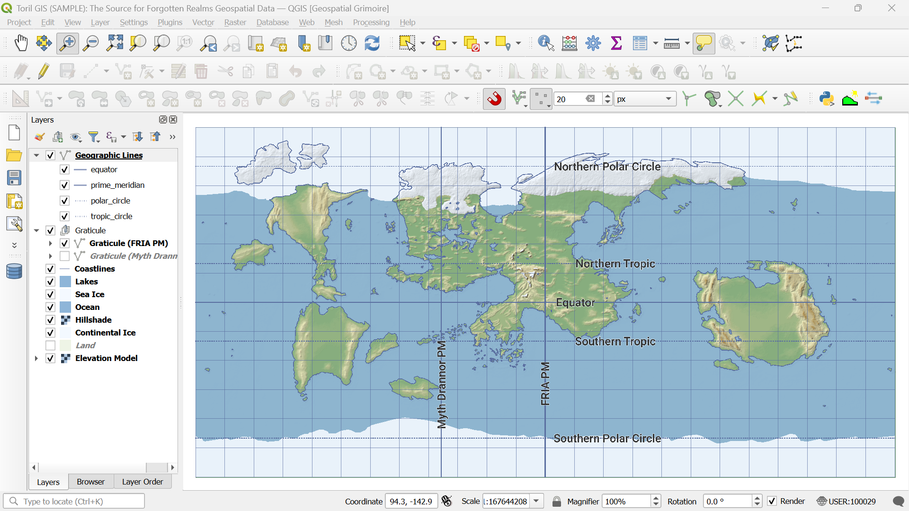

# Toril GIS Sample

*A minimal sample dataset from the [Toril GIS project](https://github.com/geospatial-grimoire/toril-gis), demonstrating the concept of a fantasy geospatial database for the planet Toril.*

<p></p>

## Quick Start

You will need [QGIS](https://qgis.org) installed (version 3.40 or later recommended).

To explore the data, open the QGIS project file:

```
toril_gis_sample.qgz
```

- The project loads all vector and raster layers, applies predefined styles, and uses the custom **Toril CRS** coordinate system.
- A `./styles/` folder is included with the QGIS layer styles used in this project.

## Overview

**Toril GIS Sample** provides an early, minimal snapshot of the developing **Toril GIS** project — a geospatial database built for the world of *Toril* (Forgotten Realms).

This repository contains coarse, highly simplified experimental layers and a prototype digital elevation model (DEM) used during initial data tests.
It is intended for demonstration and educational purposes.

## Included Layers

All layers use the **Toril GCS** coordinate reference system.
They are provided within the sample QGIS project and stored in the following files:

- **Vector data:** `./data/toril_gis.gpkg`
- **Raster data:** `./data/toril_gis_dem_v1.tif`

### Vector Layers

- **Geographic Lines** – Equator, Prime Meridian, Polar Circles, and Tropic Circles
- **Graticule**
  - *Graticule (FRIA PM)* — based on the Forgotten Realms Interactive Atlas prime meridian
  - *Graticule (Myth Drannor PM)* — aligned to the Myth Drannor prime meridian
- **Coastlines** – generalized continental and island shorelines
- **Lakes** – inland water bodies
- **Sea Ice** – polar ice coverage boundaries
- **Ocean** – extent of Toril's global oceanic surface
- **Continental Ice** – large-scale land-based ice masses
- **Land** – continental landmasses and major islands

### Raster Layers

- **Hillshade** – shaded relief derived from the DEM
- **Elevation Model** – low-resolution digital elevation model (DEM, in meters) of Toril

If desired, the same vector layers are also available reprojected in the following coordinate systems:

- `./data/toril_gis_orthographic.gpkg` — Orthographic (view-optimized globe)
- `./data/toril_gis_mollweide.gpkg` — Mollweide (equal-area pseudocylindrical)
- `./data/toril_gis_mercator.gpkg` — Mercator (conformal cylindrical)
- `./data/toril_gis_behrmann.gpkg` — Behrmann (equal-area cylindrical)

For a deeper explanation of Toril's custom coordinate systems and projection design, see:
[Crafting Coordinate Systems for Faerûn and Beyond](https://www.geospatial-grimoire.com/blog/2024/11/09/crafting-coordinate-systems-for-faerun-and-beyond.html)

## Intended Use

- Classroom demonstrations in GIS and cartography
- Personal training in QGIS, PostGIS, and raster workflows
- Technical proof of concept for mapping fictional worlds with real geospatial tools
- Early preview for contributors awaiting the public release of Toril GIS

## Notes

This dataset is not representative of the complete Toril GIS.
It is intentionally incomplete and heavily generalized — a small fossil from the earliest experiments.
The included QGIS project provides a minimal but functional environment to explore the sample data and its projections.

For more information about the ongoing work, see the [Geospatial Grimoire](https://geospatial-grimoire.com) project.

## Usage Terms

Toril GIS is unofficial Fan Content permitted under the Wizards of the Coast's [Fan Content Policy](https://company.wizards.com/en/legal/fancontentpolicy).
Not approved or endorsed by Wizards. Portions of the materials used are property of Wizards of the Coast.
© Wizards of the Coast LLC.

Attribution to *Geospatial Grimoire* is appreciated.